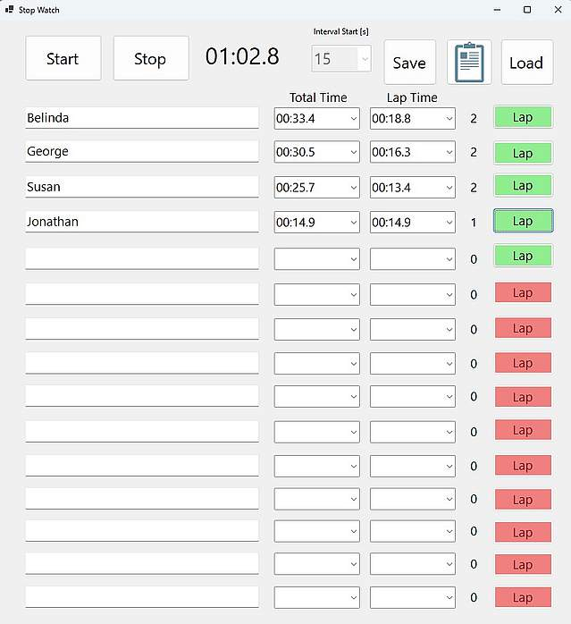

This is a simple stopwatch app for up to 15 athletes with lap timer. 
The athlete names can be entered in the app or read in via a text file. 
The stopped lap and total times can be written to a text file that can be read into spreadsheet programs.

 { width=50% }

## Written in
C# DotNet 8.0

## Built With
Windows [Visual Studio 2022 or higher](https://visualstudio.microsoft.com/de/downloads/)  

## Contributing
Everyone is invited to contribute to the project
 
## License
This project is licensed under the BSD 2-Clause License - see the [License](License.md) file for details